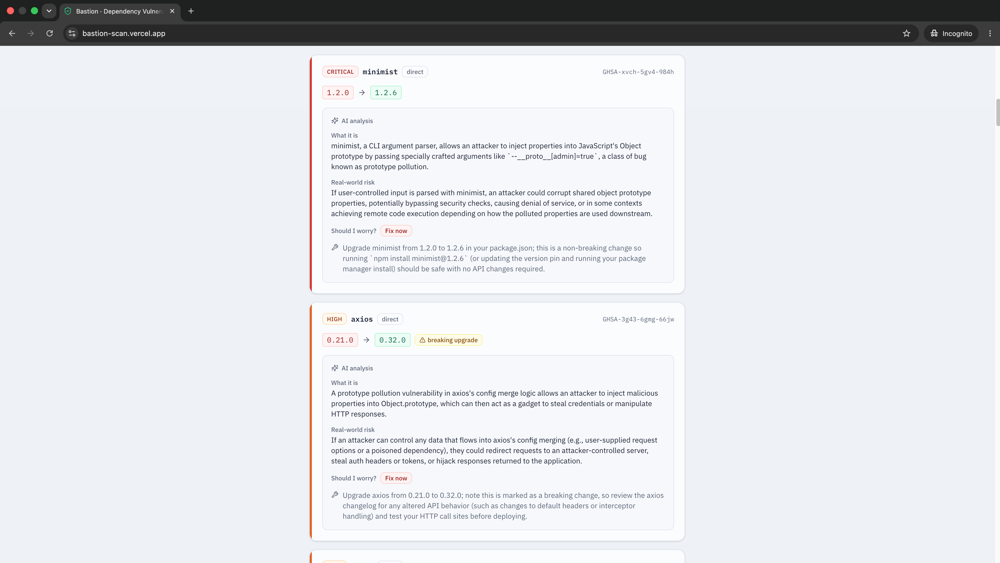
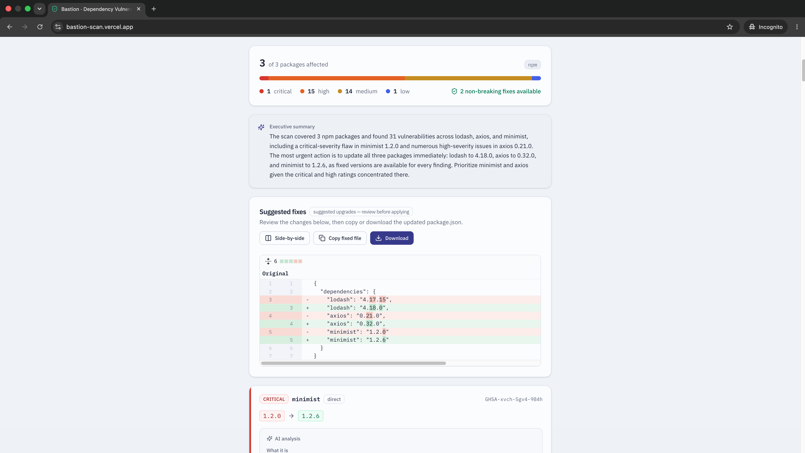
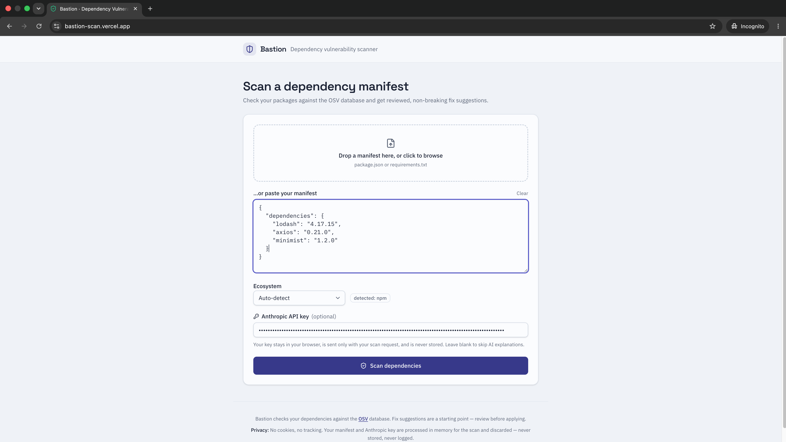

# Bastion

[](https://github.com/sameermalik20aug/bastion-scan/actions/workflows/ci.yml)

> Scan a dependency manifest for known vulnerabilities and get deterministic, reviewable fix suggestions - with optional plain English AI explanations via your own API key.

🔗 **Live demo:** https://bastion-scan.vercel.app



---

## How it works

Paste or upload a `package.json` or `requirements.txt` and Bastion runs a five-step
pipeline:

1. **Parse** the manifest into structured packages (ecosystem auto-detected).
2. **Query [OSV.dev](https://osv.dev)** - one batched request for every package,
   then a per-advisory detail fetch.
3. **Resolve fixes deterministically** - real version arithmetic picks the lowest
   version that clears every advisory, and flags breaking upgrades.
4. **Explain (optional)** - with your own Anthropic key, each verified advisory
   gets a plain-English explanation and a "should I worry?" verdict.
5. **Diff** - the exact, reviewable change to your manifest, ready to copy or
   download.



Steps 1–3 and 5 are free and need no key. Step 4 is the only part that uses AI,
and it never decides *what* is vulnerable — only how to explain it.

## Quick start

The whole stack runs locally with one command (Docker required):

```bash
docker compose up --build
```

Then open **http://localhost:5173**. The frontend talks to the backend on
**http://localhost:8000**; both are wired together by `docker-compose.yml`.



No keys or secrets are needed to run it. AI explanations are **bring-your-own-key**:
paste your Anthropic key in the UI and it's used for that one request only.

## Tech stack

- **Backend:** Python 3.13, FastAPI, Uvicorn, Pydantic v2
- **Vulnerability data:** [OSV.dev](https://osv.dev) (via an async httpx/HTTP-2 client)
- **Fix engine:** deterministic resolver using `packaging` (PyPI) and `semver` (npm)
- **AI layer (optional, BYOK):** Anthropic SDK — user-supplied key, per request
- **Frontend:** React 19, TypeScript, Vite 6, Tailwind CSS 4
- **Rate limiting:** slowapi (per-IP)
- **Packaging / deploy:** multi-stage Docker images, docker-compose for local dev

---

## Decisions & Tradeoffs

This section documents the engineering decisions behind Bastion - including what
was deliberately left out. The aim was a focused, honest tool, not a feature pile.

### Facts from an authoritative source, not from an LLM

Bastion never asks an AI whether a package is vulnerable or which version fixes
it. Those are factual questions, and LLMs hallucinate - they'll invent a CVE that
doesn't exist or cite a fixed version that was never released, which for a
security tool is worse than useless.

Instead, vulnerability data comes from [OSV.dev](https://osv.dev), Google's
open-source vulnerability database, via its `querybatch` API (one batched request
for all packages, then a per-ID detail fetch). OSV aggregates GitHub Security
Advisories, the PyPI Advisory Database, and dozens of other curated sources into
one normalised schema, and it's free with no usage limits. Using it is the same
build-vs-buy call I'd make on a real team: don't reimplement authoritative
infrastructure - wrap it.

### How this differs from Google's `osv-scanner`

Google
ships [`osv-scanner`](https://github.com/google/osv-scanner), a free CLI that
queries the same OSV data. I'm not out-engineering Google's security team.
Bastion's value is narrower and deliberate:

- **A plain-English AI explanation layer `osv-scanner` doesn't have.** OSV
  advisories are terse and jargon-heavy. Bastion uses the Claude API to translate
  each verified advisory into what the vulnerability actually is, its realistic
  exploitability, and a "Fix now / Fix this sprint / Low priority" verdict — plus
  a synthesised executive summary of the whole scan.
- **A zero-install web UI.** `osv-scanner` is a Go binary you run in a terminal
  with CI config. Bastion is paste-a-file-get-an-answer in a browser, with a
  reviewable diff of the exact change to make.

Bastion borrows the authoritative scanning and fix data from the sources that do
it best, and adds the two things they don't: readable explanations and a
frictionless interface.

### The AI explains; it never decides

There's a hard wall between the deterministic core and the AI layer. The fixer
computes which version to suggest using real version arithmetic (PEP 440 for
PyPI, SemVer for npm); OSV provides the severity; the AI receives those
already-decided facts and is told, in the system prompt, not to second-guess
them. The AI's only job is communication - explaining the flaw and prioritising
it. It never determines whether something is vulnerable, which version is safe,
or how severe an issue is. Keeping that boundary clean is the point: hallucination
in the explanation layer costs a slightly-off description; hallucination in the
decision layer would cost a missed vulnerability.

Severity follows the same rule. It's derived from OSV's own data - a CVSS score
where one exists, the advisory's own rating otherwise - and where OSV genuinely
publishes no severity, Bastion reports `unknown` rather than letting a model
invent a rating.

### Bring-your-own-key, and why it's a feature

The scan, the OSV results, the deterministic fix resolution, and the diff all run
at **zero API cost** for any user. The AI explanation and executive summary
activate only when a user supplies their own Anthropic API key. The key is held
in browser memory for the session, sent once over HTTPS with the scan request,
used for that request's Claude calls, and then discarded - it is never logged,
cached, persisted, or read from server env. (To be precise: it does transit the
server in a request header, since the Claude calls are server-side; the
commitment is that it's never written anywhere.)

This was a cost decision - the public demo stays free regardless of traffic - but
it's also a security decision I'd defend in review: third-party credentials
should have the shortest possible lifetime and the smallest possible blast
radius. Every Anthropic call is wrapped so that even an SDK auth error (which can
echo the key) never reaches a response; failures degrade gracefully to the raw
OSV summary, so the tool works end to end with no key at all.

Explanations are cached in memory by vulnerability ID, so the same CVE is never
re-explained (and never re-billed) while the server process is alive. The
tradeoff: a cached explanation is shared across users rather than isolated per
key - an acceptable choice for a free public tool, made deliberately for cost and
latency.

### Direct dependencies only, on purpose

Bastion scans **manifest files** (`package.json`, `requirements.txt`), which
means it sees your *direct* dependencies — the ones you chose. It does not yet
resolve the full transitive tree, which requires parsing lockfiles and
reconstructing the resolved graph. That's real work, and it's V2.

I'm stating this plainly rather than implying full-tree coverage, because
overclaiming is exactly what a security reviewer should catch. Knowing the
boundary of what a tool actually checks is itself a security competency;
lockfile-based transitive scanning is the first item on the roadmap.

### No database in V1

The core flow is stateless: upload → scan → return result → done. Nothing needs
to persist. Adding a database to store scan history would be scope creep dressed
as architecture — an unused ORM and a migration story for a feature V1 doesn't
have. Scan history is a real V2 feature, and *that's* when a database earns its
place. Choosing not to add one keeps the system honest about what it does.

### Two ecosystems done properly, via a parser strategy pattern

V1 ships npm and PyPI done well rather than four formats done poorly. The one
piece of structure worth investing in is the `parsers/` module: an abstract
`BaseParser` with one implementation per ecosystem. Adding Maven or RubyGems is a
new file, not a refactor - extensibility applied where it pays off, without
abstracting things that have a single implementation.

### The security posture, stated explicitly

Because this is a security tool, the threat model is deliberate rather than
implicit. The public scan endpoint is treated as hostile: rate-limited per IP via
`slowapi`, a streaming body-size cap (enforced against bytes actually read, not a
client-supplied `Content-Length`) so a large upload can't exhaust memory, and an
explicit OSV timeout so a slow upstream can't hang a worker. The uploaded manifest
is treated as untrusted input — package names flow into the Claude prompt wrapped
as delimited data, not instructions, so a crafted package name can't perform
prompt injection. Responses carry a strict header set (`nosniff`,
`X-Frame-Options: DENY`, a `default-src 'none'` CSP, HSTS), with the docs routes
exempted so Swagger still renders. The container runs as a non-root user from a
multi-stage build, shrinking the blast radius of any compromise. And because
there's no PII and no persistence, most of the attack surface simply doesn't
exist.

### Privacy

Bastion is built to hold nothing. No accounts, no database, no stored scans -
uploaded files are parsed in memory and discarded when the request finishes. No
cookies, no tracking, no analytics, so there's no consent banner because there's
nothing to consent to. The optional Anthropic key is never stored, logged, or
persisted. Dependency files aren't sensitive PII, but they're still processed in
memory only and treated as untrusted input.

### Testing

The suite covers the two modules most likely to harbour subtle bugs - the parsers
and the semver fixer - plus the OSV client, the AI service (including
key-never-leaks assertions), and integration-style tests exercising the full scan
route with mocked OSV and Anthropic. GitHub Actions runs the full suite and the
frontend build on every push and PR.

### What's deliberately out of V1

User accounts, scan history, a database, Maven and RubyGems parsers, GitHub-repo
URL scanning, a CI plugin for scanning inside other projects' pipelines, full
lockfile transitive resolution, multi-provider AI, and any "chat with your
vulnerabilities" feature. Each is either V2 scope or a gimmick. Listing them is
intentional: knowing what to leave out is most of what scoping is.

## Roadmap (V2)

- Lockfile parsing for full transitive-dependency scanning (`package-lock.json`, `poetry.lock`)
- Maven (`pom.xml`) and RubyGems (`Gemfile`) parsers
- Scan history (now a database earns its place)
- GitHub repo URL scanning
- A GitHub Action that comments suggested fixes on pull requests
- A provider-abstraction layer for the AI explanation (Anthropic / OpenAI / Gemini)

---

## CI

[`.github/workflows/ci.yml`](.github/workflows/ci.yml) runs on every push and
pull request to `main` and verifies - but never deploys - the code:

- **Backend:** installs the app + dev tools and runs `pytest`.
- **Frontend:** runs `npm ci`, then `npm run build` (which runs `tsc -b` first,
  so a type error fails the build). No separate lint step is configured.

Deployment is handled separately by Railway and Vercel's own GitHub integrations.

## Deployment

Repo / host slug: **`bastion-scan`**. The backend deploys to **Railway** and the
frontend to **Vercel**, each independently behind platform-managed TLS. Both
platforms auto-deploy from their own GitHub integration when `main` changes; CI
(above) is the gate that runs first but does not deploy.

> **Everything below must use `https://`.** The BYOK Anthropic key travels over
> the network in a request header and must never transit plain HTTP. Railway and
> Vercel both serve HTTPS automatically, and the backend sets HSTS in production
> so browsers refuse to downgrade.

### Backend → Railway

Create a service from this repo, then set:

- **Settings → Source → Root Directory:** `backend`
  (so Railway picks up [`backend/Dockerfile`](backend/Dockerfile) and
  [`backend/railway.toml`](backend/railway.toml)).
- **Builder:** Dockerfile (configured in `railway.toml`).
- The container binds `0.0.0.0:$PORT` — Railway injects `$PORT`; do **not** set
  it yourself.

**Environment variables** (Settings → Variables):

| Variable | Value |
| --- | --- |
| `BASTION_CORS_ALLOWED_ORIGINS` | your Vercel URL, e.g. `https://bastion-scan.vercel.app` |
| `BASTION_HSTS_ENABLED` | `true` |

Railway gives the service a public URL like
`https://bastion-scan-production.up.railway.app` — that is the **backend URL**
you feed to Vercel below.

### Frontend → Vercel

Import this repo as a new project, then set:

- **Root Directory:** `frontend`
- **Framework Preset:** Vite (auto-detected; pinned in
  [`frontend/vercel.json`](frontend/vercel.json))
- **Build Command:** `npm run build` · **Output Directory:** `dist`

**Environment variable** (Settings → Environment Variables, Production):

| Variable | Value |
| --- | --- |
| `VITE_API_BASE_URL` | your Railway backend URL, e.g. `https://bastion-scan-production.up.railway.app` (no trailing slash) |

Vite inlines `VITE_API_BASE_URL` at **build time**, so change it and redeploy for
it to take effect. Vercel gives the project a public URL like
`https://bastion-scan.vercel.app` - that is the **frontend URL** you put in
Railway's `BASTION_CORS_ALLOWED_ORIGINS` above.

### How the two wire together

The two URLs cross over — each side points at the other:

```
Vercel  VITE_API_BASE_URL            → https://<railway-backend-url>
Railway BASTION_CORS_ALLOWED_ORIGINS → https://<vercel-frontend-url>
```

The browser loads the app from Vercel, then calls the Railway API at
`VITE_API_BASE_URL`. That call is cross-origin, so the backend's CORS list must
name the exact Vercel origin (scheme + host, no path, no trailing slash).
**Both values must be `https://`** - a scheme mismatch (`http` vs `https`) makes
the origin fail the CORS check and the browser blocks the request.

See [`backend/.env.example`](backend/.env.example) and
[`frontend/.env.example`](frontend/.env.example) for all configuration.

## License

MIT - [`LICENSE`](LICENSE).